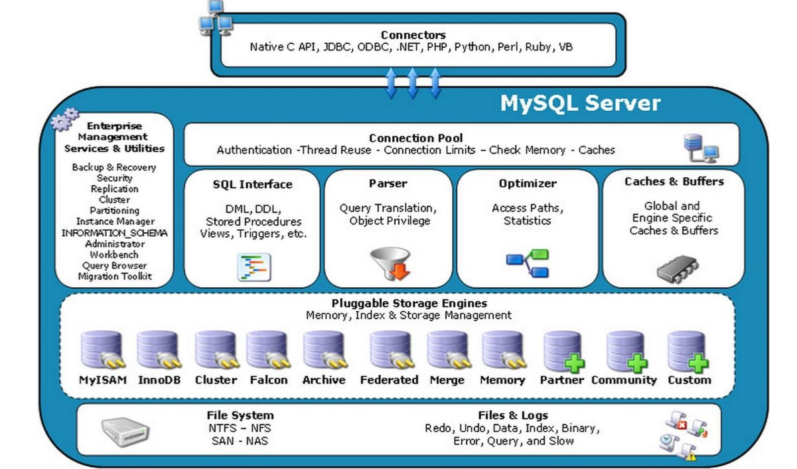
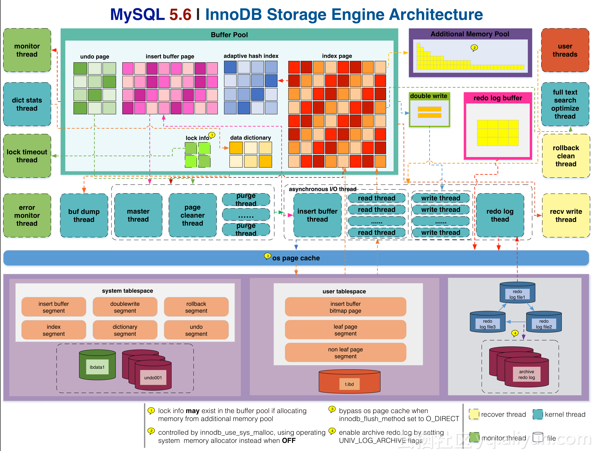

体系结构：

  

MySQL由以下几部分组成：

- 连接池组件（Connection Pool）
- 管理服务和工作组件（Enterprise Management Services & Utilities）
- SQL接口组件（SQL Interface）
- 查询分析器组件（Parser）
- 优化器组件（Optimizer）
- 缓冲组件（Caches & Buffers）
- 插件式存储引擎（Pluggable Storage Engines）
- 物理文件（File System）

Mysql存储引擎：


查看数据支持的引擎：

1. 执行命令：SHOW ENGINES
2. 查看information_schema数据库中的ENGINES表


XA:
MySQL XA 是基于Open Group 的<<Distributed Transaction Processing:The XA Specification>> 标准实现的，支持分布式事务，允许多个数据库实例参与一个全局的事务

Savepoints:
在MySQL中, 保存点SAVEPOINT属于事务控制处理部分。利用SAVEPOINT可以回滚指定部分事务，从而使事务处理更加灵活和精细

相关SQL语句：

```mysql
#创建表时指定引擎方式1
CREATE TABLE `demo_users`  (
  `id` bigint(0) UNSIGNED NOT NULL AUTO_INCREMENT,
  `username` varchar(255) NOT NULL COMMENT 'username',
  PRIMARY KEY (`id`)
) ENGINE = ARCHIVE COMMENT = 'demo table';
#创建表时指定引擎方式2
CREATE TABLE `demo_engines` ENGINE=MyISAM AS SELECT * FROM `demo_users`;
#修改引擎
ALTER TABLE `demo_engines` ENGINE = INNODB;
#删除demo表
DROP TABLE IF EXISTS `demo_users`,`demo_engines`;
```

连接MySQL

连接MySQL操作是一个连接进程和MySQL数据库实例进行通信，本质上是进程通信，常用的进程通信方式有

管道、命名管道、TCP/IP套接字、UNIX域套接字。

TCP/IP：最常用的方式

```shell
#命令行
mysql -h127.0.0.1 -uroot -p
#JDBC
jdbc:mysql://localhost/rtvitrunk?useUnicode=true&characterEncoding=utf-8&allowMultiQueries=true&useSSL=false
```

InnoDB体系架构：



##### 内存：


##### 线程：


后台线程：

​	Master Thread：核心后台线程，将缓冲池中的数据异步刷新到磁盘，保证数据一致性，包括：脏页的刷新，合并插入缓冲，							   UNDO页的回收等

​	IO Thread：write, read, insert buffer, log IO thread

​	Purge Thread：回收已经使用并分配的undo页

​	Page Cleaner Thread：脏页的刷新操作


内存：

缓冲池

相关SQL语句：

show variables like '%innodb%';

```mysql
#相关innodb相关变量
show variables like '%innodb%';
#查看innodb运行状态
show engine innodb status;
#查看缓冲池状态
SELECT * FROM information_schema.`INNODB_BUFFER_POOL_STATS`;
```

```mysql
#相关innodb相关变量说明
innodb_purge_threads
innodb_write_io_threads
innodb_read_io_threads
innodb_page_size
#最新访问的页存放的位置，此位置叫mid（新读取的页插入到LRU列表尾端的37%）（此值越小，热点页被刷出概率越小）
innodb_old_blocks_pct = 37
#页读取到mid位置后等待多久才能加入LRU列表的热端
innodb_old_blocks_time = 1000
innodb_max_dirty_pages_pct
#缓冲池实例数量
innodb_buffer_pool_instances = 1
#缓冲池大小
innodb_buffer_pool_size = 134217728
```

缓冲池的管理：

LRU List

​	innodb_old_blocks_pct = 37，为什么不直接放入LRU首部，某些SQL操作可能会使缓冲池中的页被刷新出，如：索引或数据的扫描	

​	LRU列表的old部分加入到new部分的操作叫：page made young

​	因innodb_old_blocks_time设置导致页没有从old加入到new：page not made young

Free List

Flush List：脏页列表


```mysql
#show engine innodb status;重点注释，information_schema库中INNODB相关表也可查看相关信息
----------------------
BUFFER POOL AND MEMORY
----------------------
Total large memory allocated 137428992
Dictionary memory allocated 801311
#缓冲池大小为：8191*16K=131056K,127M(每个页大小16K)
#Buffer pool size > LRU列表中页的数量 + Free列表中页的数量,
#因为缓冲池的页还会配置给：自适应哈希索引、Lock信息、Insert Buffer等页（这些页不需要LRU维护，未放到LRU列表中）
Buffer pool size   8191
#Free列表中页的数量
Free buffers       1024
#LRU列表中页的数量
Database pages     6134
Old database pages 2244
Modified db pages  0
Pending reads      0
Pending writes: LRU 0, flush list 0, single page 0
#Pages made young：LRU列表中页被移到前端的次数
Pages made young 85427, not young 3073200
0.07 youngs/s, 0.00 non-youngs/s
Pages read 12697, created 2543, written 28249
0.00 reads/s, 0.00 creates/s, 0.24 writes/s
#Buffer pool hit rate：缓冲池的命中率，一般应该大于95%
Buffer pool hit rate 1000 / 1000, young-making rate 14 / 1000 not 0 / 1000
Pages read ahead 0.00/s, evicted without access 0.00/s, Random read ahead 0.00/s
#innodb支持页压缩功能，默认页大小为16K，可压缩为：1K，2K，4K，8K，非16K页由unzip_LRU管理
#LRU中的页包含了unzip_LRU中的页
LRU len: 6134, unzip_LRU len: 0
I/O sum[11]:cur[0], unzip sum[0]:cur[0]
```

LRU列表中的页被修改后称为：脏页，通过checkpoint机制，将脏页刷新回磁盘


