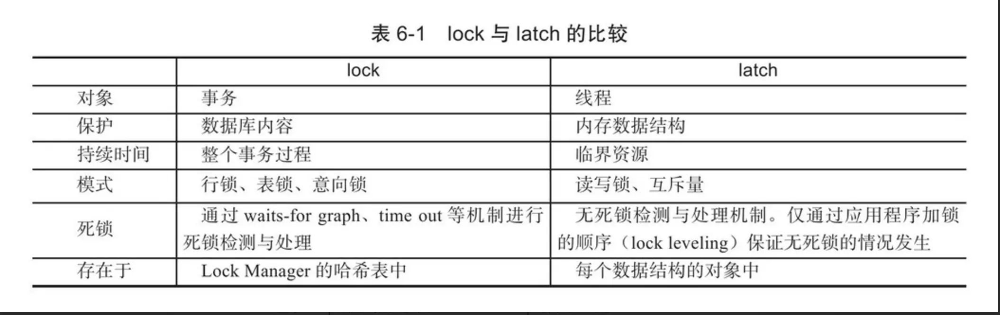
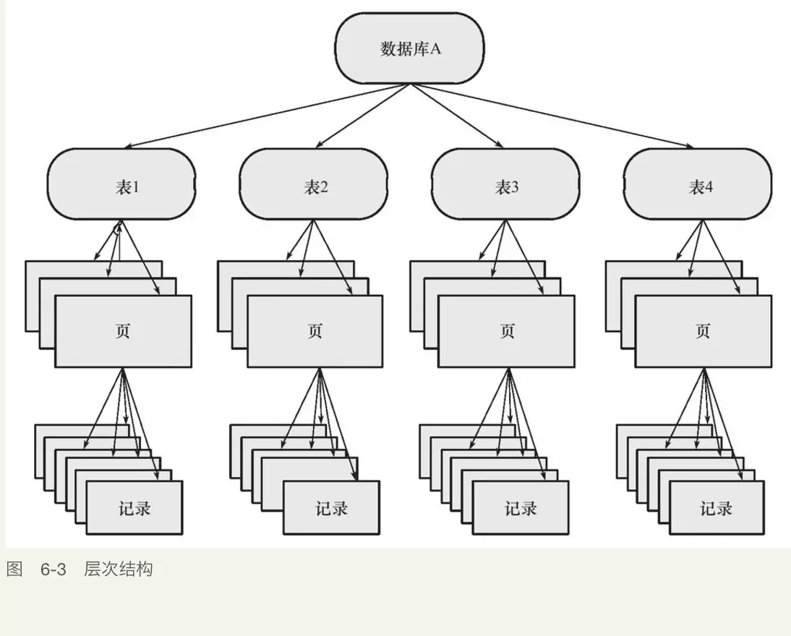
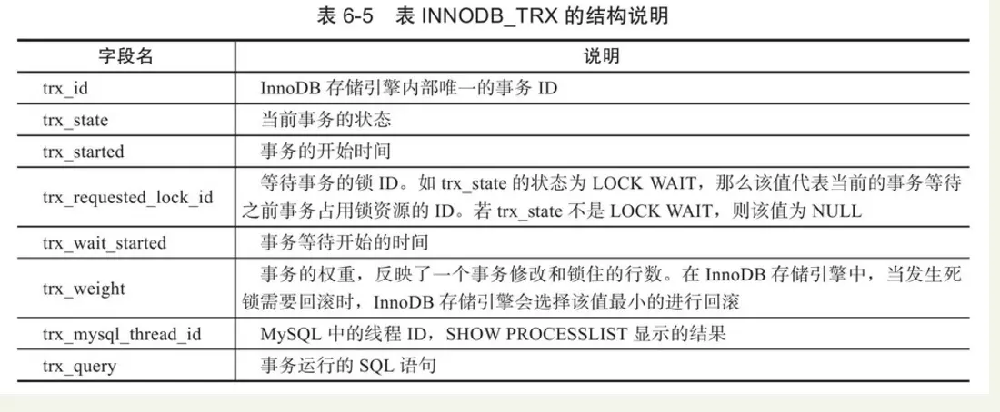
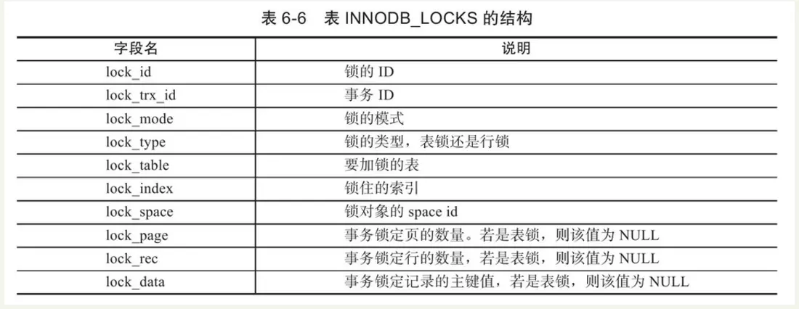
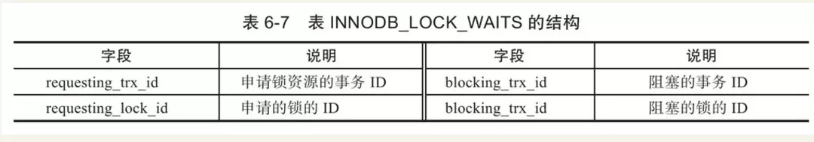
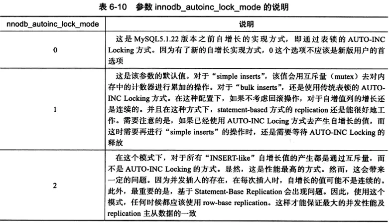

[再谈mysql锁机制及原理—锁的诠释](https://juejin.im/post/5dac651451882529d1528e12)

InnoDB行锁是通过给索引上的索引项加锁来实现的，InnoDB这种行锁实现特点意味着：只有通过索引条件检索数据，InnoDB才使用行级锁，否则，InnoDB将使用表锁！

### 意向锁到底有什么作用？

**innodb的意向锁主要用户多粒度的锁并存的情况**。比如事务A要在一个表上加S锁，如果表中的一行已被事务B加了X锁，那么该锁的申请也应被阻塞。如果表中的数据很多，逐行检查锁标志的开销将很大，系统的性能将会受到影响。为了解决这个问题，可以在表级上引入新的锁类型来表示其所属行的加锁情况，这就引出了“意向锁”的概念。

举个例子，如果表中记录1亿，事务A把其中有几条记录上了行锁了，这时事务B需要给这个表加表级锁，如果没有意向锁的话，那就要去表中查找这一亿条记录是否上锁了。如果存在意向锁，那么假如事务Ａ在更新一条记录之前，先加意向锁，再加Ｘ锁，事务B先检查该表上是否存在意向锁，存在的意向锁是否与自己准备加的锁冲突，如果有冲突，则等待直到事务Ａ释放，而无须逐条记录去检测。事务Ｂ更新表时，其实无须知道到底哪一行被锁了，它只要知道反正有一行被锁了就行了。


----------------------------------------------------------mysql innodb笔记---------------------------------------------------------------------------------------

#### 锁

锁是数据库系统区别于文件系统的一个关键特性。锁机制用于管理对共享资源的并发访问

##### latch：

闩锁，轻量级的锁，时间必须非常短，保证并发线程操作临界资源的正确性，通常没有死锁检测机制
	mutex：互斥量
	rwlock：读写锁

##### lock: (重点)

lock的对象是事务，用于锁定数据库中的对象，如表、页、行



```mysql
#查看latch锁信息
SHOW ENGINE INNODB MUTEX;
#查看lock锁信息1
SHOW ENGINE INNODB STATUS;
#2 information_chema库中的：INNODB_TRX、INNODB_LOCKS、INNODB_LOCK_WAITS

```


##### InnoDB实现了两种标准的行级锁：

共享锁（S Lock），允许事务读一行数据。

排他锁（X Lock），允许事务删除或更新一行数据。

InnoDB存储引擎支持多粒度（granular）锁定，这种锁定允许事务在行级上的锁和表级上的锁同时存在。为了支持在不同粒度上进行加锁操作，引入了意向锁（Intention Lock），意向锁是将锁定的对象分为多个层次：数据库、表、页

##### 两种意向锁：主要是为了在一个事务中揭示下一行将被请求的锁类型

 1）意向共享锁（IS Lock），事务想要获得一张表中某几行的共享锁
 2）意向排他锁（IX Lock），事务想要获得一张表中某几行的排他锁














##### 一致性非锁定读，多版本并发控制（Multi Version Concurrency Control, MVCC）

一致性的非锁定读（consistent nonlocking read）是指InnoDB存储引擎通过行多版本控制（multi versioning）的方式来读取当前执行时间数据库中行的数据。如果读取的行正在执行DELETE或UPDATE操作，这时读取操作不会因此去等待行上锁的释放。相反地，InnoDB存储引擎会去读取行的一个快照数据。

READ COMMITED事务隔离级别下：						非一致性读总是读取被锁定行的最新一份快照数据（不可重复读）

REPEATABLE READ事务隔离级别下（默认级别）：非一致性读总是读取事务开始时的行数据版本（可重复读）

##### 一致性锁定读

```mysql
# 显式加X锁
SELECT * FROM rtv_user WHERE id = 1 FOR UPDATE;
#显式加S锁
SELECT * FROM rtv_user WHERE id = 1 LOCK IN SHARE MODE
```

##### 自增长与锁

AUTO-INC Locking：特殊的表锁机制，非事务完成后释放，而是在完成对自增长值插入的SQL语句后立即释放

##### innodb_autoinc_lock_mode：




##### 外键和锁

外键主要用于引用完整性的约束检查，外键列如果没有显式地加索引，InnoDB会自动加一个索引，避免表锁。

外键值的插入或更新，首先需要查询父表中的记录，这不采用一致性非锁定读，会发生数据不一致，而是使用SELECT...LOCK IN SHARE MODE，即对父表加S锁，如果这时父表已经有X锁，子表的操作就会被阻塞

#### 锁的算法

##### InnoDB存储引擎有3种行锁的算法，其分别是：

##### 	Record Lock：单个行记录上的锁

​		总是会去销售索引记录，没有索引就锁定隐式的主键

##### 	Gap Lock：间隙锁，锁定一个范围，但不包含记录本身

​		

##### 	Next-Key Lock∶Gap Lock+Record Lock，锁定一个范围，并且锁定记录本身

​		InnoDB对于行的查询都是采用这种锁定算法，称为Next-Key Locking，设计的目的是为了解决Phantom Problem


##### 事务隔离级别

```mysql
SELECT @@tx_isolation;
SELECT @@global.tx_isolation;
SET SESSION tx_isolation = 'READ-UNCOMMITTED';
SET SESSION tx_isolation = 'READ-COMMITTED';
SET SESSION tx_isolation = 'REPEATABLE READ';
SET SESSION TRANSACTION ISOLATION LEVEL READ UNCOMMITTED;
SET SESSION TRANSACTION ISOLATION LEVEL READ COMMITTED;
SET SESSION TRANSACTION ISOLATION LEVEL REPEATABLE READ;
SET GLOBAL TRANSACTION ISOLATION LEVEL REPEATABLE READ;

SET AUTOCOMMIT=off 或者 start transaction

#可以看到未提交的数据（脏读），举个例子：别人说的话你都相信了，但是可能他只是说说，并不实际做。
read uncommitted

#读取提交的数据。但是，可能多次读取的数据结果不一致（不可重复读，幻读）。用读写的观点就是：读取的行数据，可以写。
read committed

#可以重复读取，但有幻读。读写观点：读取的数据行不可写，但是可以往表中新增数据。在MySQL中，其他事务新增的数据，看不到，不会产生幻读。采用多版本并发控制（MVCC）机制解决幻读问题。(MySQL默认隔离级别)
3.repeatable read

#可读，不可写。像java中的锁，写数据必须等待另一个事务结束。
serializable
```

##### 


