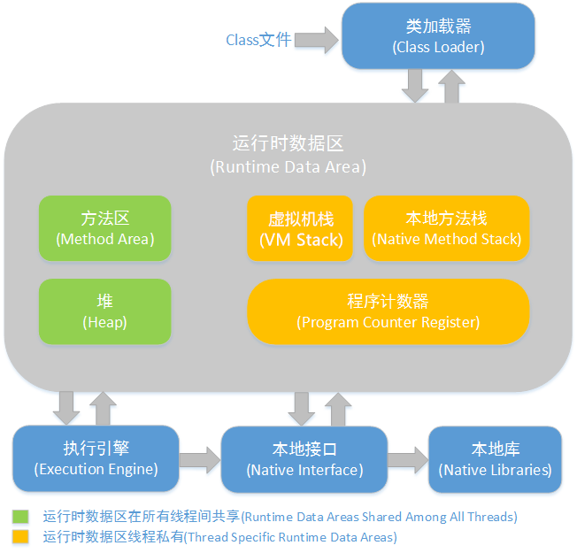

##### 全面理解Java内存模型(JMM)及volatile关键字： https://blog.csdn.net/javazejian/article/details/72772461 

### Java内存区域

#### 运行时数据区（Runtime Data Area）

##### 程序计数器（Program Counter Register）

程序计数器较小的内存空间，可看作当前线程执行的字节码的行号指示器。

线程私有，执行Native方法时为空（Undefined），唯一在Java虚拟机规范中没有规定任何OutOfMemoryError情况的区域。

##### Java虚拟机栈（Java Virtual Machine Stacks）

Java虚拟机栈也是线程私有，生命周期与线程相同，它描述的是Java方法执行的内存模型：每个方法在执行的同时都会创建一个栈帧（Stack Frame）用于存储 局部变量表、操作数栈、动态链接、方法出口等信息。每一个方法从调用至执行完成的过程，对应一个栈帧在虚拟机栈中入栈到出栈的过程。常说的Java内存分为堆内存、栈内存，这里就是指Java虚拟机栈。

局部变量表存放编译期可知的各种基本数据类型、对象引用（可能是指向对象起始地址的引用指针，也可能指向代表对象的句柄或其他与对象相关的位置）和returnAddress类型（指向了一条字节码指令的地址），64位长度的long和double占用2个局部变量空间（Slot），其他数据类型占用一个。局部变量表所需的内存空间在编译期间完成分配，进入方法时，需要在帧中分配多大局部变量空间是确定的，方法运行期间不会改变局部变量表大小。

此区域规定了两种异常：StackOverflowError（线程请求的栈深度大于虚拟机允许的深度），OutOfMemoryError（动态扩展时无法申请到足够内存）

##### 本地方法栈（Native Method Stack）

本地方法栈与虚拟机栈相似，区别是虚拟机栈为虚拟机执行Java方法（字节码）服务，本地方法栈为虚拟机使用到的Native方法服务。虚拟机可自由实现它，HotSpot虚拟机直接把本地方法栈和虚拟机栈合二为一，也会抛出：StackOverflowError，OutOfMemoryError。

##### Java堆（Java Heap）

一般是Java虚拟机管理的内存中最大的一块，线程共享，虚拟机启动时创建，用于存放对象实例，几

##### 方法区

##### 运行时常量池

##### 直接内存

#### HotSpot虚拟机对象探秘

##### 对象的创建

​	虚拟机遇到new指令时，

​	1.判断是类否加载（常量池定位类的符号引用，检查是否加载），若未加载则要执行类加载

​	2.为新生对象分配内存，所需内存大小在类加载完就已确定，分配内存的方式有：

​		指针碰撞（Bump the Pointer）：如果内存规整，分配了的内存放一边，空闲的内存放另一边，中间指针作为分界点，分配空间时把指针向空闲空间挪动对象大小相等的距离（Serial、ParNew等带Compact过程的收集器采用指针碰撞），

​		空闲列表（Free List）：如果内存不规整，维护一个列表，记录哪些内存块可用， 分配空间时，从列表中找到足够大的空间划分给对象实例，并更新列表上的记录（基于Mark-Sweep算法的CMS收集器通常采用空闲列表）

​		指针碰撞的线程安全问题的两种方案：

​		a.分配内存空间的动作进行同步处理，虚拟机采用CAS配上失败重试的方式保证更新操作的原子性

​		b.把内存分配 的动作按线程划分到不同的空间进行，即每个线程预先分配一小块内存，称为本地线程分配缓冲（Thread Local Allocation Buffer TLAB）只有TLAB用完并分配新的TLAB时，才需要同步锁定，是否启用参数：-XX+/-UseTLAB			

​	3.

##### 对象的内存布局

##### 对象的访问定位

