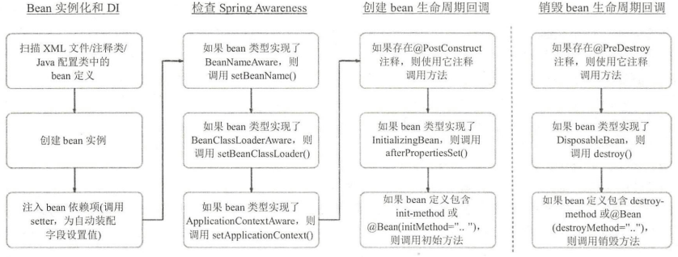

> ##### IOC DI

https://juejin.im/post/5b040cf66fb9a07ab7748c8b

**[Spring 常见问题总结](https://snailclimb.gitee.io/javaguide/#/docs/system-design/framework/spring/SpringInterviewQuestions)**

[Spring中bean的作用域与生命周期](https://snailclimb.gitee.io/javaguide/#/docs/system-design/framework/spring/SpringBean)

[Spring中都用到了那些设计模式?](https://snailclimb.gitee.io/javaguide/#/docs/system-design/framework/spring/Spring-Design-Patterns)

[Spring框架\]Spring IOC的原理及详解。](https://www.cnblogs.com/wang-meng/p/5597490.html)

[Spring IOC 容器源码分析](https://javadoop.com/post/spring-ioc)

[Spring IoC有什么好处呢？](https://www.zhihu.com/question/23277575/answer/169698662)

------

> #### 什么是IOC，实现原理，注意事项？

​	控制反转（Inversion of Control，IoC），IoC的核心是DI（dependency Injection），首先IoC是一种通用的机制或者技术，这种机制负责独立地管理和维护程序中的依赖项以及依赖项之间的关系，它能够让应用程序通过描述来生成或者获取依赖对象，应用程序只需要申明需要哪些依赖项，而不需要负责创建和管理这些依赖项，也就是将对依赖对象的控制转交给第三方来管理。

​	IoC可以分为两种子类型：依赖注入和依赖查找，这两种子类型是IoC的不同形式，Spring IoC容器是则具体的实现。

##### 依赖注入常见风格：构造函数注入、setter依赖注入、字段注入（field injection）@Autowired、简单值@Values（SpEL注入值）

**构造函数注入优先场景：**使用组件之前必须拥有此依赖项，也有助于实现不可变对象（因为未提供set方法），但是会有循环依赖问题

**setter注入优先场景：**组件向容器公开了它的依赖项，并乐于提供自己的默认值，它允许在接口上声明依赖项，能解决循环依赖的问题

**字段注入其实非常方便常用，但是有缺点：**1不再是POJO，不能独立实例化，2不能用于final字段，3不明确依赖项的类型以及是否强制

##### 依赖查找有两种类型：依赖拉取（dependency pull，DL），和 上下文依赖查找（contextualized dependency lookup，CDL）

依赖拉取：根据需要从注册表中提取依赖项（applicationContext.getBean）

上下文依赖查找：查找是针对管理资源的容器执行的，而不是来自某个中央注册表

##### Spring中的控制反转

控制反转是 Spring 重要组成部分，Spring实现的核心是基于依赖注入，也提供了依赖查找功能（有时会用到，首选依赖注入）。

##### Spring 依赖注入的体系结构

##### BeanFacotry

​	Spring IoC容器是一个管理Bean的容器，它的核心是BeanFacotry接口，所有的IoC容器都需要实现此接口，它是一个顶级容器接口，它负责管理组件，包括依赖项以及它们的生命周期，（bean是指容器管理的任何组件）

TODO 截图BeanFacotry Structure

有多个getBean方法，，这是IoC容器最重要的方法，它的意义是从IoC容器中获取Bean，可以by name, by type

DefaultListableBeanFactory

XmlBeanDefinitionReader, PropertiesBeanDefinitionReader, 

##### ApplicationContext

ApplicationContext接口是BeanFacotry的一个扩展（子接口），功能更强大，除了DI服务，还提供了事务、AOP、国际化、事件等，

扩展了消息国际化接口（MessageSource ）、
环境可配置接口（EnvironmentCapable ）、
应用事件发布接口（ApplicationEventPublisher）
资源模式解析接口（ResourcePatternResolver ）

与Spring交互应该使用ApplicationContext接口，而非BeanFactory接口，在Web容器环境中，一般通过ContextLoaderListener来支持ApplicationContext的启动（web.xml）

@Configuration代表配置文件, @Bean 注册Bean, @ConponentScan扫描注解装配Bean到IoC容器

AnnotationConfigApplicationContext

最初Spring通过属性或XML文件定义bean，JDK5发布，Spring从2.5开始支持注解，然后支持Java配置，可以支持混用

@ImportResource(locations = {"classpath:spring/app-context xml.xml"}) 

@Autowired 字段注入，消除歧义性：

@primary配置优先权, 这个是打到实现类上，在相同的实现类中，只能有一个是@primary

@Quelifier 通过类型和名称一起找到Bean，这是打到引用的字段上

@Quelifier("dog") 
private Animal animal = null; 

public Buss nessPerson(@Autowired @Qualifier("dog”) Animal animal) { 

@DependsOn

##### 生命周期

资源定位（@ComponentScan等） -> Bean定义（将Bean的定义保存到BeanDefinition的实例中）

发布Bean定义（IoC容器装载Bean定义） -> 实例化（创建Bean的实例对象）

-> 依赖注入（@Autowired等）

@ComponentScan有lazyInit属性，若为false，则在发布Bean定义后，并不会马上进行实例化和注入

ApplicationContextAware接口，@PostConstruct, @PreDestroy, BeanPostProcessor接口（后置Bean初始化器）

@ConfigurationProperties("jdbc")，放配置文件中的jdbc前缀的属性全部映射到对象中

@PropertySource(value={”classpath:jdbc.properties”}, ignoreResourceNotFound=true) ，加载自定义配置文件

##### 条件装配Bean：

@Bean (name = "dataSource" , destroyMethod = "close") 

@Conditional(DatabaseConditional.class)

@Conditional 注解，配置了类 DatabaseConditional类，那么这个类就必须实现Conditional接口和实现matches方法

##### Bean的作用域：

singleton 单例 （使用范围：所有Spring应用）

prototype 每当从IoC中取出时新建（使用范围：所有Spring应用）

request 单次请求（使用范围：Spring Web 应用）

session HTTP会话（使用范围：Spring Web 应用）

application 定义在ServletContext的生命周期中（使用范围：Spring Web 应用）

globalSession 全局会话，所有会话共享一个实例，基本不用（使用范围：Spring Web 应用）

websocket：bean被定义为在websocket的生命周期中复用一个单例对象。

@Profile 环境切换

##### 自动装配Bean （5种）

**byName：**通过属性的名字匹配Bean

**byType：**通过属性的类型匹配Bean

**构造函数：**按构造函数的参数类型匹配Bean（匹配最大数量的参数的构造函数）

**默认模式：**Spring自动在构造函数模式和byType之间选择，有默认无参构造函数用byType，否则用构造函数，Spring3.0之后已经被标记为`@Deprecated`

**无 （默认设置）：**即不会在未明确申明需要依赖的情况下，不进行自动注入（未标记注解或set方法等）

@Lazy注解，在类级别使用时，声明在第一次被访问时才会实例化，

使用注解（@Autowired）时默认是使用byType模式，如果有相同的类型，则需要用@Qulifier来按名字匹配

##### 生命周期

参考：

Spring5高级编程，深入浅出Spring Boot 2.x

##### [Spring IOC 原理与IOC 容器实现](https://juejin.im/post/5dc9503ce51d45225b4770fd)

------

